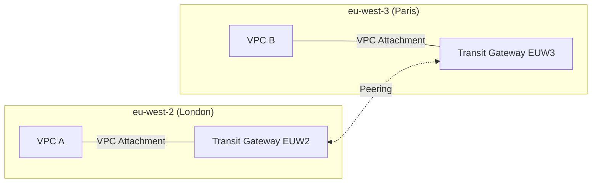

# matt-tgw-poc

A learning-focused proof-of-concept showing how two AWS VPCs in different regions connect via AWS Transit Gateways (TGWs) with centralized egress principles.

- **VPC A**: eu-west-2 (London)
- **VPC B**: eu-west-3 (Paris)
- **TGWs**: One TGW per region (eu-west-2 + eu-west-3), peered together
- **Goal**: VPC A ↔ TGW (eu-west-2) ↔ TGW (eu-west-3) ↔ VPC B

### Why this matters
Centralizing egress via a TGW reduces duplicated NAT gateways, simplifies traffic inspection, and enforces consistent security controls across VPCs and regions.

### Architecture (Mermaid)


### File layout (why there are multiple .tf files)
Terraform automatically loads all `.tf` files in a directory. Splitting by concern improves readability:
- `terraform/providers.tf`: AWS providers (default = eu-west-2, alias `sg` = eu-west-3)
- `terraform/main.tf`: Calls modules to create VPCs, TGWs, and attachments
- `terraform/tgw_peering.tf`: TGW peering between Sydney and Singapore
- `terraform/routes.tf`: TGW route table associations and routes across TGWs
- `terraform/vpc_routes.tf`: VPC route tables pointing inter-VPC CIDRs to the TGW

You can collapse these into fewer files later; for learning, this separation makes it easier to follow.

### Modules used (simple and descriptive)
- `modules/vpc`: Creates one VPC + one private subnet
- `modules/tgw`: Creates one TGW + its route table
- `modules/tgw-attach`: Attaches a VPC to a TGW

Naming is intentionally simple and purpose-first for learning. In production, you might use a single `vpc` module with options instead of `-basic` variants.

### How to run
```bash
cd terraform
terraform init
terraform plan -out tfplan
terraform apply tfplan
```

### Notes on cross-region TGW
- A VPC attachment must be in the same region as its TGW.
- For cross-region connectivity, create a TGW in each region and peer them (what this PoC does).
- AWS RAM is used for cross-account sharing; not required for same-account TGW peering.

### Optional connectivity test
- Add a tiny EC2 in each VPC (allow ICMP in SG), then ping private IP across regions.
- If you want, we can add a minimal EC2 module here to automate the test.

### EC2 ping test (SSM-based, best practice)
This repo includes an optional, private-only test using AWS Systems Manager (SSM):
- Two EC2s (one per VPC) without public IPs
- SSM IAM role/profile for the instances
- VPC Interface Endpoints for SSM/SSMMessages/EC2Messages in each VPC
- Security groups allow ICMP only between VPC CIDRs

How to run:
```bash
cd terraform
terraform plan -out tfplan -input=false
terraform apply -auto-approve tfplan
```
Then in AWS Console:
- Systems Manager > Fleet Manager: wait until both instances are Managed
- Start a Session Manager session to instance A and ping instance B’s private IP (see outputs)

### Test with SSM (this PoC)
1) Confirm instances are Managed in both regions
   - eu-west-2 and eu-west-3: Systems Manager > Fleet Manager → Managed nodes should show the two EC2s
2) Get current private IPs from Terraform outputs (on your machine)
   ```bash
   cd terraform
   terraform output -raw ec2_a_private_ip   # 10.10.1.x (eu-west-2)
   terraform output -raw ec2_b_private_ip   # 10.20.1.x (eu-west-3)
   ```
3) Session Manager ping
   - Start a session on eu-west-2 instance, run: `ping -c 4 <eu-west-3 IP>`
   - Start a session on eu-west-3 instance, run: `ping -c 4 <eu-west-2 IP>`
4) If ping fails, check quickly
   - Security Groups: ICMP allowed from the opposite VPC CIDR (10.10.0.0/16 ↔ 10.20.0.0/16)
   - Endpoints: VPC Interface Endpoints for `ssm`, `ssmmessages`, `ec2messages` are Available in both VPCs
   - Service-linked role: `AWSServiceRoleForAmazonSSM` exists
   - Routes: VPC RT to local TGW; TGW default RTs have static route to opposite VPC via peering
   - Optional: Reachability Analyzer from one ENI to the other to pinpoint any block

Files added for test:
- `terraform/modules/ssm-iam`: IAM role/profile for SSM
- `terraform/modules/ssm-endpoints`: VPC Interface Endpoints for SSM services
- `terraform/modules/ec2-ssm`: EC2 instance wired to SSM
- `terraform/ec2_test.tf`: SGs, endpoints per VPC, and two EC2s + outputs

Note: This approach is preferred over public SSH for least privilege and no internet exposure.

### Draw.io (optional)
Add `diagram/tgw-poc.drawio` and export to PNG/SVG. The Mermaid diagram above is enough for most PoCs.

### Cleanup
```bash
cd terraform
terraform destroy
```

### Current apply status
- Applied successfully. Example outputs:
  - `vpc_a_id`: vpc-0a8ec1b571139dcf4 (eu-west-2)
  - `vpc_b_id`: vpc-072d86feed17488a7 (eu-west-3)

