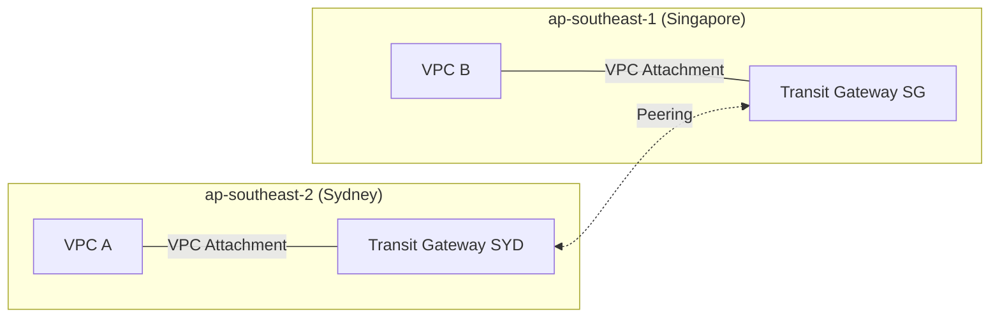

# matt-tgw-poc

A learning-focused proof-of-concept showing how two AWS VPCs in different regions connect via AWS Transit Gateways (TGWs) with centralized egress principles.

- **VPC A**: ap-southeast-2 (Sydney)
- **VPC B**: ap-southeast-1 (Singapore)
- **TGWs**: One TGW per region (Sydney + Singapore), peered together
- **Goal**: VPC A ↔ TGW (SYD) ↔ TGW (SG) ↔ VPC B

### Why this matters
Centralizing egress via a TGW reduces duplicated NAT gateways, simplifies traffic inspection, and enforces consistent security controls across VPCs and regions.

### Architecture (Mermaid)


### File layout (why there are multiple .tf files)
Terraform automatically loads all `.tf` files in a directory. Splitting by concern improves readability:
- `terraform/versions.tf`: Terraform and provider versions
- `terraform/providers.tf`: AWS providers (default = Sydney, alias `sg` = Singapore)
- `terraform/main.tf`: Calls modules to create VPCs, TGWs, and attachments
- `terraform/tgw_peering.tf`: TGW peering between Sydney and Singapore
- `terraform/routes.tf`: TGW route table associations and routes across TGWs
- `terraform/vpc_routes.tf`: VPC route tables pointing inter-VPC CIDRs to the TGW

You can collapse these into fewer files later; for learning, this separation makes it easier to follow.

### Modules used (simple and descriptive)
- `modules/vpc`: Creates one VPC + one private subnet
- `modules/tgw`: Creates one TGW + its route table
- `modules/tgw-attach`: Attaches a VPC to a TGW

Naming is intentionally simple and purpose-first for learning. In production, you might use a single `vpc` module with options instead of `-basic` variants.

### How to run
```bash
cd terraform
terraform init
terraform plan -out tfplan
terraform apply tfplan
```

### Notes on cross-region TGW
- A VPC attachment must be in the same region as its TGW.
- For cross-region connectivity, create a TGW in each region and peer them (what this PoC does).
- AWS RAM is used for cross-account sharing; not required for same-account TGW peering.

### Optional connectivity test
- Add a tiny EC2 in each VPC (allow ICMP in SG), then ping private IP across regions.
- If you want, we can add a minimal EC2 module here to automate the test.

### Draw.io (optional)
Add `diagram/tgw-poc.drawio` and export to PNG/SVG. The Mermaid diagram above is enough for most PoCs.

### Cleanup
```bash
cd terraform
terraform destroy
```

