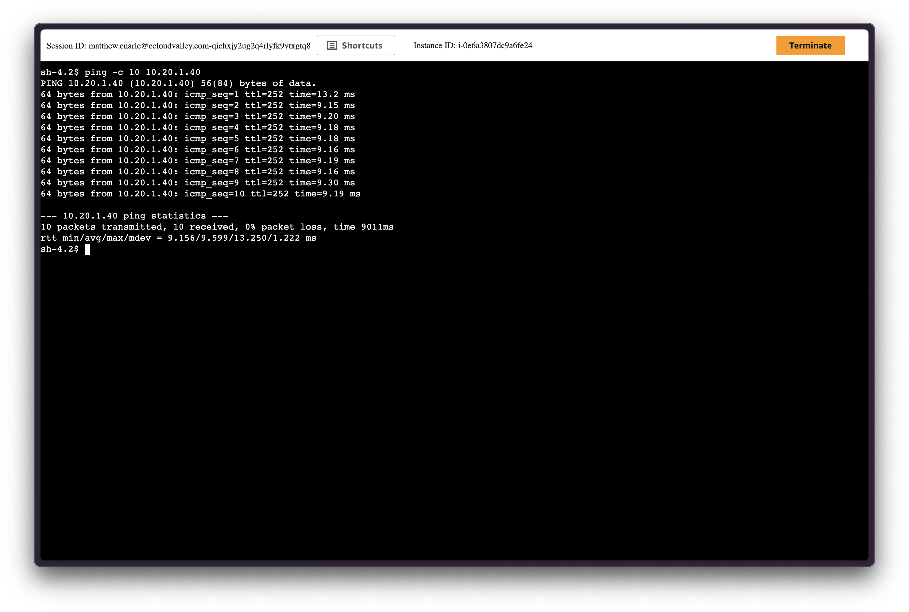
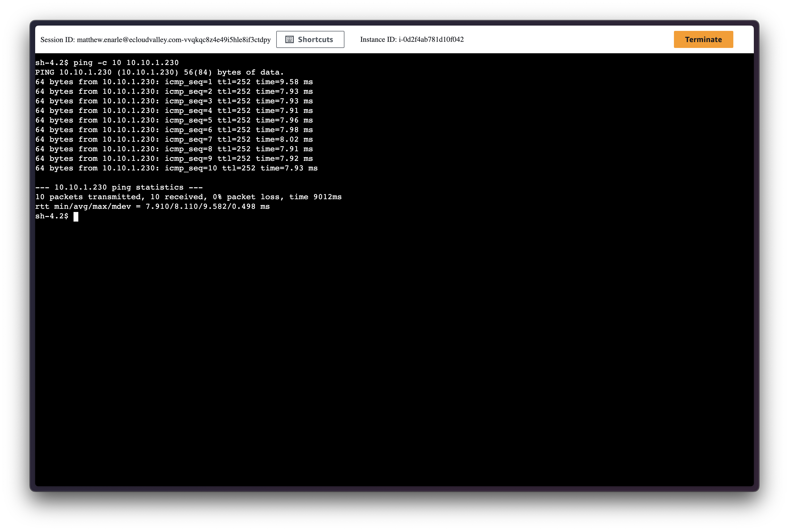

# matt-tgw-poc

A proof-of-concept showing how two AWS VPCs in different regions connect via AWS Transit Gateways (TGWs).

- **VPC A**: eu-west-2 (London)
- **VPC B**: eu-west-3 (Paris)
- **TGWs**: One TGW per region (eu-west-2 + eu-west-3), peered together
- **Goal**: VPC A ↔ TGW (eu-west-2) ↔ TGW (eu-west-3) ↔ VPC B

### Why this matters
Centralizing egress via a TGW reduces duplicated NAT gateways, simplifies traffic inspection, and enforces consistent security controls across VPCs and regions.

### Architecture (Mermaid)


### File layout 
Terraform automatically loads all `.tf` files in a directory. Splitting by concern improves readability:
- `terraform/providers.tf`: AWS providers (default = eu-west-2, alias `sg` = eu-west-3)
- `terraform/main.tf`: Calls modules to create VPCs, TGWs, and attachments
- `terraform/tgw_peering.tf`: TGW peering between Sydney and Singapore
- `terraform/routes.tf`: TGW route table associations and routes across TGWs
- `terraform/vpc_routes.tf`: VPC route tables pointing inter-VPC CIDRs to the TGW


### Modules 
- `modules/vpc`: Creates one VPC + one private subnet
- `modules/tgw`: Creates one TGW + its route table
- `modules/tgw-attach`: Attaches a VPC to a TGW

### How to run
```bash
cd terraform
terraform init
terraform plan -out tfplan
terraform apply tfplan
```

### Notes on cross-region TGW
- A VPC attachment must be in the same region as its TGW.
- For cross-region connectivity, create a TGW in each region and peer them (what this PoC does).

How to run:
```bash
cd terraform
terraform plan -out tfplan -input=false
terraform apply -auto-approve tfplan
```

### Test with SSM (this PoC)
1) Confirm instances are Managed in both regions
   - eu-west-2 and eu-west-3: Systems Manager > Fleet Manager → Managed nodes should show the two EC2s
2) Get current private IPs from Terraform outputs (on your machine)
   ```bash
   cd terraform
   terraform output -raw ec2_a_private_ip   # 10.10.1.x (eu-west-2)
   terraform output -raw ec2_b_private_ip   # 10.20.1.x (eu-west-3)
   ```
3) Session Manager ping
   - Start a session on eu-west-2 instance, run: `ping -c 4 <eu-west-3 IP>`
        
   - Start a session on eu-west-3 instance, run: `ping -c 4 <eu-west-2 IP>`
        
     
4) Voila! You can now ping cross region through transit gateways! 

Files added for test:
- `terraform/modules/ssm-iam`: IAM role/profile for SSM
- `terraform/modules/ssm-endpoints`: VPC Interface Endpoints for SSM services
- `terraform/modules/ec2-ssm`: EC2 instance wired to SSM
- `terraform/ec2_test.tf`: SGs, endpoints per VPC, and two EC2s + outputs

Note: This approach is preferred over public SSH for least privilege and no internet exposure.!


### Cleanup
```bash
cd terraform
terraform destroy
```

### realizations and next steps
- centralized egress: hub egress vpc (euw2) on tgw; app vpcs send 0.0.0.0/0 → local tgw; tgw 0.0.0.0/0 → egress (nat/network firewall).
- centralized ingress: edge vpc (alb/nlb + waf) on tgw; edge → app vpc cidrs via tgw.
- cross-account: share tgw via ram; hub + shared-services in a network account.

